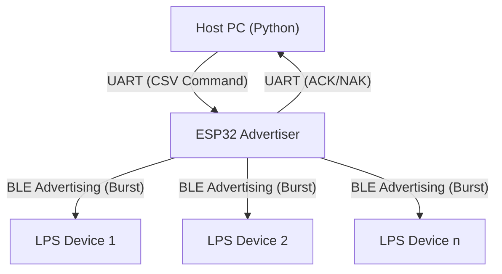

# ESP32 Advertiser

本專案包含 ESP32 韌體 (`adv_esp`) 與 PC 端 Python 控制套件 (`lps-ctrl`)。

系統透過 PC 發送指令，經由 UART 傳輸至 ESP32，再由 ESP32 透過 BLE 廣播 (Advertising) 將指令與同步訊號發送至接收端 (LPS, Light Playback System)。


## 功能架構 (System Architecture)


### 通訊流程圖



1. **PC 控制層 (`lps-ctrl`)**
* 將指令封裝為帶有「預期送達時間 (Delay)」的 CSV 格式。
* 處理指令重試 (Retry) 機制與解析 ESP32 回傳的狀態 (ACK/DONE)。


2. **硬體橋接層 (`adv_esp`)**
* 透過 UART ( baud rate: 921600 ) 接收 PC 指令。
* 解析指令並計算精確的觸發時間。
* 使用 **Raw HCI** (Host Controller Interface) 繞過標準藍牙協議棧，直接控制藍牙射頻發送廣播封包。


3. **無線廣播層 (BLE Interface)**
* 不建立連線 (Connectionless)，採用廣播 (Advertising) 模式。
* **Burst 機制**: 在目標時間到達前，ESP32 會連續發送一連串更新「剩餘時間 (Remaining Delay)」的封包。
* **LPS 接收端**: 只要收到 Burst 中的任一封包，即可算出正確的絕對執行時間，達成多裝置同步。


## 專案結構

```text
├── adv_esp/                # ESP32 BLE Advertiser
│   ├── CMakeLists.txt      
│   └── main/
│       ├── CMakeLists.txt  
│       ├── main.c          # UART 處理、指令解析、任務排程
│       ├── bt_sender.c     # BLE HCI 控制、廣播封包組建
│       └── bt_sender.h     
├── lps-ctrl/               # Python 控制套件
│   ├── examples/           # 使用範例
│   ├── src/lps_ctrl/       # 核心原始碼
│   ├── pyproject.toml      # 定義檔
│   └── README.md           

```

