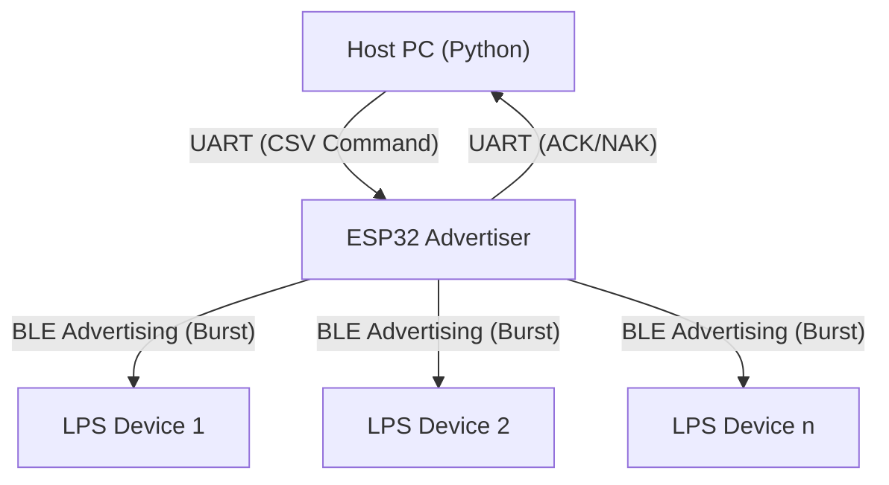

# ESP32 Advertiser

This project includes the ESP32 firmware (`adv_esp`) and a PC-side Python control package (`lps-ctrl`).

The system sends commands from a PC via UART to the ESP32. The ESP32 then transmits these commands and synchronization signals to the receivers (LPS, Light Playback System) via BLE Advertising.

## System Architecture

### Communication Flow Diagram



1. **PC Control Layer (`lps-ctrl`)**
* Encapsulates commands into a CSV format containing the "Expected Arrival Time (Delay)."
* Handles the command retry mechanism and parses the status returned by the ESP32 (ACK/DONE).


2. **Hardware Bridge Layer (`adv_esp`)**
* Receives PC commands via UART (baud rate: 921600).
* Parses commands and calculates the precise trigger time.
* Utilizes **Raw HCI** (Host Controller Interface) to bypass the standard Bluetooth stack, directly controlling the Bluetooth RF to transmit advertising packets.


3. **Wireless Broadcasting Layer (BLE Interface)**
* Operates in connectionless mode, utilizing BLE Advertising.
* **Burst Mechanism**: Before the target time arrives, the ESP32 continuously transmits a series of packets updating the "Remaining Delay."
* **LPS Receiver**: Upon receiving *any* single packet from the Burst, the receiver can calculate the correct absolute execution time, achieving multi-device synchronization.


## Project Structure

```text
├── adv_esp/                # ESP32 BLE Advertiser
│   ├── CMakeLists.txt      
│   └── main/
│       ├── CMakeLists.txt  
│       ├── main.c          # UART handling, command parsing, task scheduling
│       ├── bt_sender.c     # BLE HCI control, advertising packet construction
│       └── bt_sender.h     
├── lps-ctrl/               # Python control package
│   ├── examples/           # Usage examples
│   ├── src/lps_ctrl/       # Core source code
│   ├── pyproject.toml      # Configuration file
│   └── README.md           

```