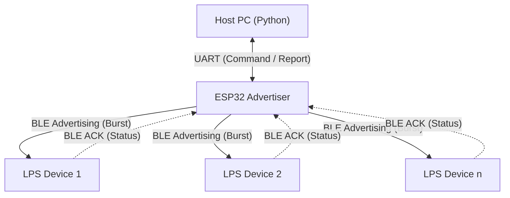

# ESP32 Advertiser

This project includes the ESP32 firmware (`adv_esp`) and a PC-side Python control package (`lps-ctrl`).

The system sends commands from a PC via UART to the ESP32. The ESP32 transmits these commands to the receivers (LPS, Light Playback System) via BLE Advertising, and collects status feedback via BLE Scanning.

## System Architecture

### Communication Flow Diagram



1. **PC Control Layer (`lps-ctrl`)**

* Encapsulates commands into a CSV format containing the "Expected Arrival Time (Delay)."
* **Non-blocking Control**: Implements an asynchronous architecture to trigger status checks without blocking the main command stream.
* Parses streaming status reports (`FOUND:...`) returned by the ESP32.

2. **Hardware Bridge Layer (`adv_esp`)**

* Receives PC commands via UART (baud rate: 921600).
* **Hybrid Role**: Acts primarily as a Broadcaster, but switches to **Observer (Scanner) Mode** when a `CHECK` command is issued.
* Utilizes **Raw HCI** to bypass the standard Bluetooth stack for precise timing control.

3. **Wireless Broadcasting Layer (BLE Interface)**

* **Burst Mechanism**: Continuously transmits synchronization packets before the target time arrives.
* **LPS Receiver**: Syncs time upon receiving *any* single packet.
* **Status Feedback**: Receivers respond with an ACK packet containing their current state and remaining delay when queried, allowing the PC to monitor fleet status.

## Project Structure

```text
├── adv_esp/                # ESP32 BLE Advertiser
│   ├── CMakeLists.txt      
│   └── main/
│       ├── CMakeLists.txt  
│       ├── main.c          # UART handling, command parsing, task scheduling
│       ├── bt_sender.c     # BLE HCI control (TX & RX), packet assembly
│       └── bt_sender.h     
├── lps-ctrl/               # Python control package
│   ├── examples/           # Usage examples
│   ├── src/lps_ctrl/       # Core source code
│   ├── pyproject.toml      # Configuration file
│   └── README.md           
```