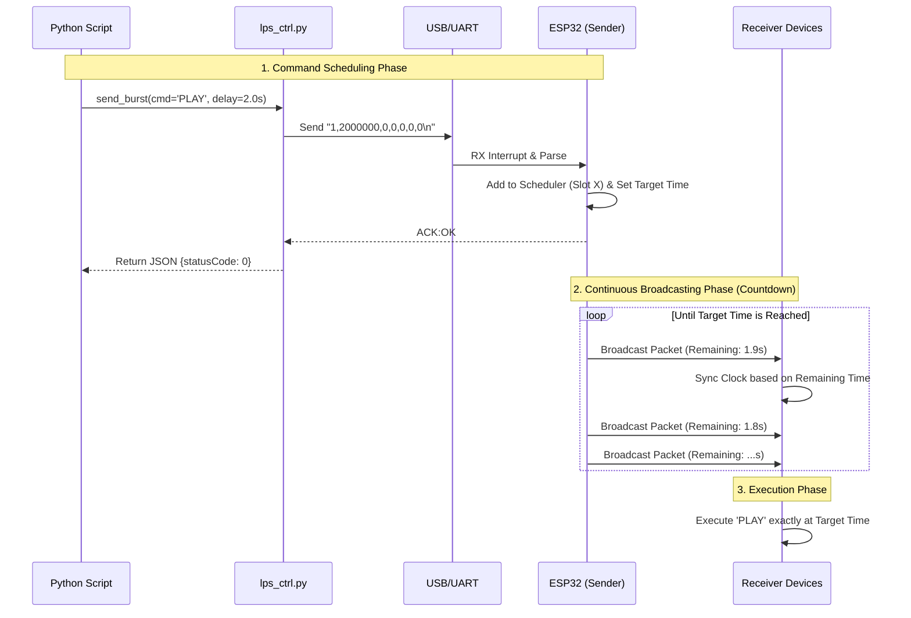

# ESP32 BLE Sender - UART Controlled

This project provides a Python module, `lps_ctrl.py`, which implements a system to control an ESP32 via UART (USB Serial) from a PC. The ESP32 acts as a central **Sender** to broadcast Bluetooth Low Energy (BLE) command packets using a non-blocking scheduler. This allows for precise, interleaved broadcasting of multiple commands to distributed receivers (e.g., light suits).

## Installation

It is recommended to create a virtual environment in the `lps-ctrl` directory (where `pyproject.toml` is located) and install the required packages.

```bash
python3 -m venv venv
source venv/bin/activate
pip install -e .
```

## System Workflow



### Key Concepts

1. **PC-Side (lps_ctrl)**: Formats parameters into a CSV string and sends it via Serial. It waits for an `ACK` from the ESP32 to confirm the command was accepted.
2. **ESP32 Scheduler (Immediate Broadcast)**:
* Once a task is added, the ESP32 **immediately starts broadcasting** it in a round-robin fashion.
* The broadcast packet contains the **remaining time** (counting down in real-time) until the target execution timestamp.
* Broadcasting stops automatically when the target timestamp is reached.


3. **Synchronization**: Receivers listen for these packets. Even if they receive the packet at different times (e.g., one at 1.9s remaining, another at 0.5s remaining), they both calculate the same absolute **Target Execution Time**, ensuring synchronized action.

## API Documentation

### Class: `ESP32BTSender`

```python
__init__(port, baud_rate=921600, timeout=1)
```

* **port** (Required): Serial port name (e.g., `'COM3'` on Windows or `'/dev/ttyS3'` on Linux).
* **baud_rate**: Default is `921600`. Must match the `main.c` setting in the firmware.
* **timeout**: Default is `1` second.

### Method: `send_burst`

Sends a command packet to the ESP32.

```python
send_burst(cmd_input, delay_sec, prep_led_sec, target_ids, data)
```

#### Parameters

| Parameter | Type | Description |
| --- | --- | --- |
| **cmd_input** | `str` | Command type (see Mapping Table below). |
| **delay_sec** | `float` | Time in seconds before the command executes. **Must be > 1.0s**. |
| **prep_led_sec** | `float` | Duration for the "Preparation LED" effect. |
| **target_ids** | `list[int]` | List of Target IDs (e.g., `[1, 2]`). Use `[0]` for **Broadcast All**. |
| **data** | `list[int]` | list of 3 integers `[d0, d1, d2]` for extra parameters. |

#### Command Mapping Table

The following commands are supported by the firmware:

| Command | Hex Code | Description | Data Parameter Usage |
| --- | --- | --- | --- |
| **PLAY** | `0x01` | Start timeline/playback. | `[0, 0, 0]` |
| **PAUSE** | `0x02` | Pause playback. | `[0, 0, 0]` |
| **STOP** | `0x03` | Stop and reset position. | `[0, 0, 0]` |
| **RELEASE** | `0x04` | Release memory/Unload. | `[0, 0, 0]` |
| **TEST** | `0x05` | Test Mode / LED Color. | `[R, G, B]` (0-255) or `[0,0,0]` for default pattern. |
| **CANCEL** | `0x06` | Cancel a pending command. | `[cmd_id, 0, 0]` (Use the ID returned by send_burst) |

#### Return Value

Returns a dictionary containing the `command_id` assigned by the ESP32:

```json
{
    "from": "Host_PC",
    "topic": "command",
    "statusCode": 0,
    "payload": {
        "target_id": "[]",
        "command": "PLAY",
        "command_id": "1",
        "message": "Success"
    }
}
```

### Method: `trigger_check`

Sends a `CHECK` command. The ESP32 will broadcast a ping to all devices and then immediately switch to **Scanning Mode** to listen for responses.

```python
trigger_check(target_ids=[])
```

* **Non-blocking**: This function returns immediately so you can continue your script.
* **Background Process**: The ESP32 will scan for exactly **2 seconds**.

### Method: `get_latest_report`

Retrieves the results of the scan initiated by `trigger_check`.

```python
get_latest_report()
```

#### Return Value (Example)

```json
{
    "from": "Host_PC",
    "topic": "check_report",
    "statusCode": 0,
    "payload": {
        "scan_duration_sec": 2,
        "found_count": 1,
        "found_devices": [
            {
                "target_id": 1,          
                "cmd_id": 1,             
                "cmd_type": 1,           
                "target_delay": 5398880, 
                "state": "UNLOADED"      
            }
        ]
    }
}
```

## Constraints & Best Practices

### 1. The "Radio Blind Spot"

The ESP32 has only one radio. It **cannot broadcast and scan simultaneously**.

* When you call `trigger_check()`, the ESP32 enters **Observer Mode** for 2 seconds.
* Any `send_burst` commands sent *during* this 2-second window will be **queued** and broadcast only *after* the scan finishes.

### 2. Queue Limit (Max 16)

The firmware scheduler can hold a maximum of **16 pending commands**.

* **Do not** send >16 commands instantly (e.g., in a tight loop).
* If the queue is full, the ESP32 will return `NAK` and `statusCode` will be `-1`.

## Example Usage

Run the example script to see the flow of scheduling commands and checking status.

```bash
python .\examples\lps_ctrl_ex.py
```
Return json:

```json
{
    "from": "Host_PC",
    "topic": "command",
    "statusCode": 0,
    "payload": {
        "target_id": "[]",
        "command": "PLAY",
        "command_id": "0",
        "message": "Success"
    }
}
{
    "from": "Host_PC",
    "topic": "command",
    "statusCode": 0,
    "payload": {
        "target_id": "[]",
        "command": "PAUSE",
        "command_id": "1",
        "message": "Success"
    }
}
{
    "from": "Host_PC",
    "topic": "command",
    "statusCode": 0,
    "payload": {
        "target_id": "[]",
        "command": "CANCEL",
        "command_id": "2",
        "message": "Success"
    }
}
{
    "from": "Host_PC",
    "topic": "check_trigger",
    "statusCode": 0,
    "payload": {
        "target_id": "[]",
        "command": "CHECK",
        "command_id": "3",
        "message": "Check started (ID: 3)"
    }
}
{
    "from": "Host_PC",
    "topic": "command",
    "statusCode": 0,
    "payload": {
        "target_id": "[]",
        "command": "STOP",
        "command_id": "4",
        "message": "Success"
    }
}
{
    "from": "Host_PC",
    "topic": "command",
    "statusCode": 0,
    "payload": {
        "target_id": "[]",
        "command": "TEST",
        "command_id": "5",
        "message": "Success"
    }
}
{
    "from": "Host_PC",
    "topic": "check_report",
    "statusCode": 0,
    "payload": {
        "scan_duration_sec": 2,
        "found_count": 1,
        "found_devices": [
            {
                "target_id": 1,
                "cmd_id": 4,
                "cmd_type": 3,
                "target_delay": 5405590,
                "state": "READY"
            }
        ]
    }
}
```